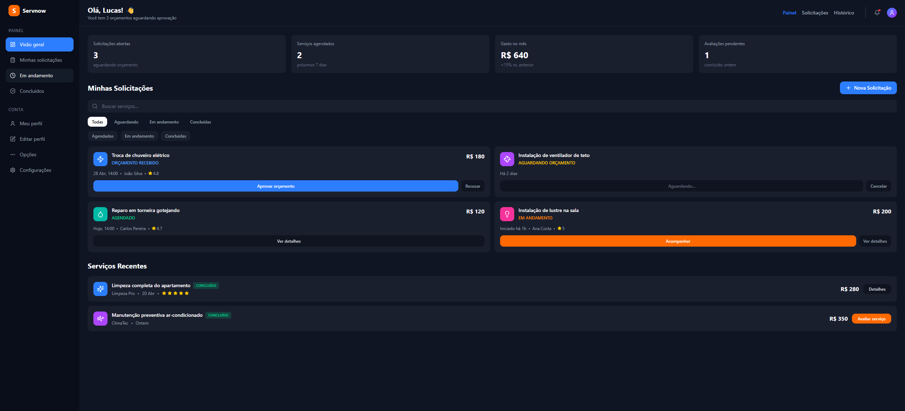

# 6. Interface do sistema

_Visão geral da interação do usuário por meio das telas do sistema. Abaixo são apresentadas as principais interfaces da plataforma ServNow._

## 6.1. Tela principal do sistema

Na tela da Home Page, serão apresentadas informações gerais sobre a plataforma, explicando de forma clara como ela funciona e qual é o seu propósito.

Também serão exibidas as principais categorias de serviços disponíveis, destacando os tipos de atividades nas quais os prestadores podem se cadastrar e atuar.

Além disso, a página contará com uma seção dedicada às vantagens da plataforma, evidenciando seus benefícios tanto para clientes quanto para prestadores de serviço.

Por fim, serão exibidos feedbacks e avaliações de clientes, com o objetivo de gerar confiança e demonstrar a qualidade dos serviços oferecidos.

.jpg>)

---
## 6.1.2 Tela  de Login

## 6.2. Telas do processo 1 — Gestão de Clientes

_As telas referentes ao processo de Gestão de Clientes serão adicionadas nesta seção._

### 6.2.1. Tela de cadastro de cliente

Tela destinada ao cadastro de novos  clientes na plataforma ServNow. Nela, o cliente informa seus dados pessoais (nome, CPF, e-mail, telefone e CEP), e define sua senha de acesso. O layout segue o padrão visual da plataforma, com uma seção ilustrativa à esquerda reforçando os benefícios de se tornar um cliente e o formulário de cadastro à direita. O usuário também pode alternar entre as opções "Sou cliente" e "Sou prestador" no topo do formulário.

### 6.2.2. Tela de configuração de perfil

---

## 6.3. Telas do processo 2 — Gestão de Prestadores

_Telas referentes ao processo de cadastro, login e gerenciamento do prestador de serviços na plataforma._

### 6.3.1. Tela de cadastro do prestador

Tela destinada ao cadastro de novos prestadores na plataforma ServNow. Nela, o profissional informa seus dados pessoais (nome, CPF, e-mail, telefone e CEP), seleciona sua área de atuação (eletricista, encanador, pintor, etc.) e define sua senha de acesso. O layout segue o padrão visual da plataforma, com uma seção ilustrativa à esquerda reforçando os benefícios de se tornar um prestador e o formulário de cadastro à direita. O usuário também pode alternar entre as opções "Sou cliente" e "Sou prestador" no topo do formulário.

### 6.2.2. Tela de configuração de perfil

---

## 6.4. Telas do processo 3 — Solicitação de Serviço

### 6.4.1. Painel do cliente

Após a aprovação do cadastro e do login, o cliente é direcionado ao seu painel de controle. O painel apresenta um resumo das solicitações (solicitações publicadas por ele, solicitações concluídas e gastos mensais).

Na seção central, o cliente pode visualizar e filtrar suas solicitações por status, como concluídas, aguardando aceite e com data mais recente , além de criar novas solicitações.

O painel também permite acesso ao gerenciamento do perfil do cliente 

### 6.4.2. Tela de nova solicitação

_Descrição da tela de nova solicitação de serviço._ implementar

### 6.3.3. Painel do prestador

Após a aprovação do cadastro e login, o prestador é direcionado ao seu painel de controle. O painel apresenta um resumo das principais informações do profissional, incluindo indicadores de desempenho (solicitações novas, serviços concluídos no mês, ganhos acumulados e avaliação média). Na seção central, o prestador pode visualizar e filtrar as solicitações de clientes por proximidade, valor, data ou urgência, com informações detalhadas sobre cada serviço — valor proposto, duração estimada, localização e dados do cliente. O painel também exibe o histórico de serviços recentes e a barra lateral permite acesso ao gerenciamento do perfil profissional 

## 6.5. Telas do processo 4 — Acompanhamento do serviço

_As telas referentes ao processo de execução e finalização do serviço serão adicionadas nesta seção._

### 6.5.1. Tela de confirmação de chegada do prestador

_Descrição da tela de confirmação de chegada com código de verificação._

> _A ser adicionada_

### 6.5.2. Tela de preenchimento da ordem de serviço-prestador

_Descrição do serviço realizado, fotos, materiais usados

### 6.5.3. Tela de acompanhamento da ordem de serviço-cliente

_Descrição da tela de acompanhamento a ordem de serviço pelo cliente.

### 6.5.4. Tela de pagamento

> _A ser adicionada_

### 6.5.5. Tela de avaliação do serviço

_Descrição da tela de avaliação do serviço pelo cliente após a conclusão._

> _A ser adicionada_
