# 6. Interface do sistema

_Visão geral da interação do usuário por meio das telas do sistema. Abaixo são apresentadas as principais interfaces da plataforma ServNow._

## 6.1. Tela principal do sistema

Na tela da Home Page, serão apresentadas informações gerais sobre a plataforma, explicando de forma clara como ela funciona e qual é o seu propósito.

Também serão exibidas as principais categorias de serviços disponíveis, destacando os tipos de atividades nas quais os prestadores podem se cadastrar e atuar.

Além disso, a página contará com uma seção dedicada às vantagens da plataforma, evidenciando seus benefícios tanto para clientes quanto para prestadores de serviço.

Por fim, serão exibidos feedbacks e avaliações de clientes, com o objetivo de gerar confiança e demonstrar a qualidade dos serviços oferecidos.

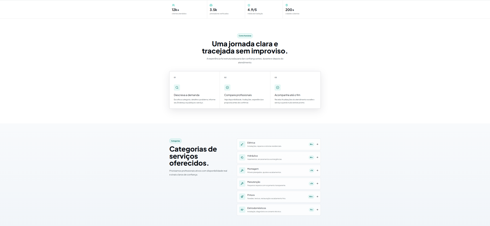
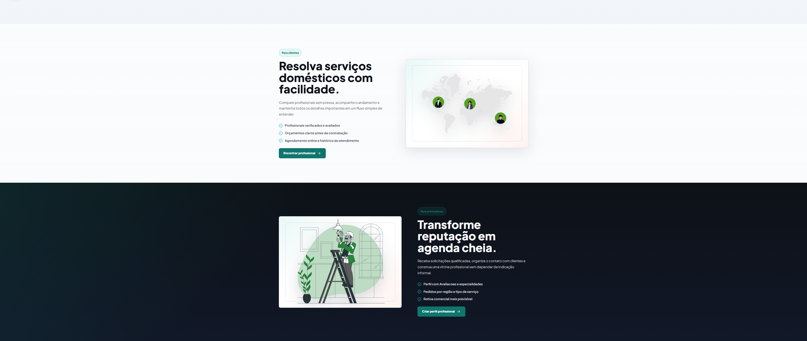
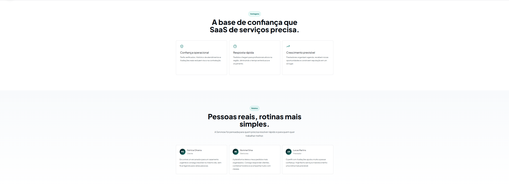

---
## 6.1.2 Tela  de Login

## 6.1.2 Tela  de Cadastro Prestador
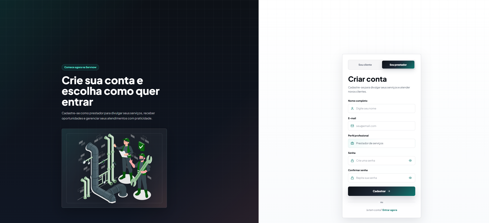

### 6.1.3 Tela de Cadastro de cliente

## 6.2. Telas do processo 1 — Gestão de Clientes

Telas referentes ao Pefil e configuração do perfil dos Clientes

### 6.2.1. Tela de configuração de perfil

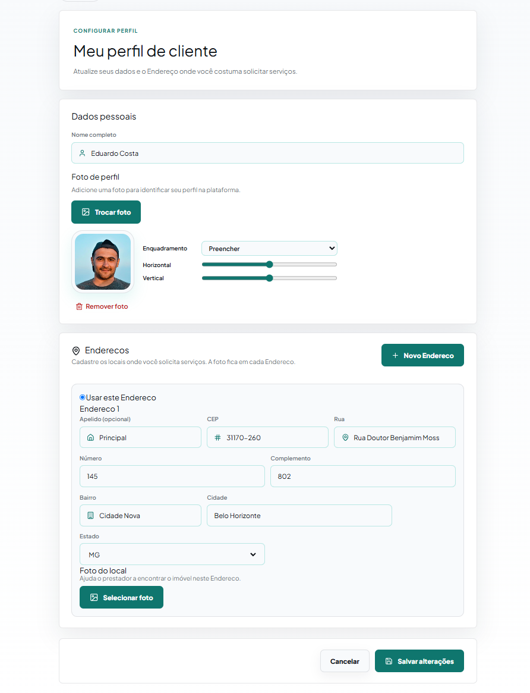

Tela de configuração de perfil do cliente. Permite inserir nome completo, endereço detalhado (rua, número, CEP, bairro, cidade e estado) e uma foto do local/endereço. Ao final, o botão "Salvar alterações" confirma as informações cadastradas.

---

### 6.2.1. Tela de de perfil
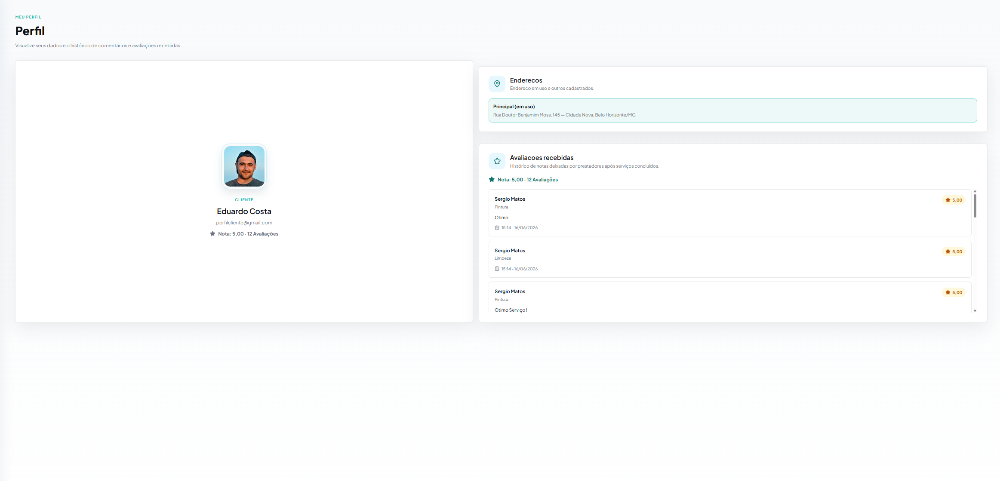

Na tela de perfil são exibidas as principais informações do usuário, incluindo sua foto de perfil, o endereço atualmente cadastrado e as avaliações recebidas. Além disso, a página apresenta os comentários realizados por outros usuários, permitindo visualizar o histórico de feedbacks e a reputação construída na plataforma.

## 6.3. Telas do processo 2 — Gestão de Prestadores

Telas referentes ao Pefil e configuração do perfil dos Prestadores

### 6.3.1. Tela de configuração de perfil 

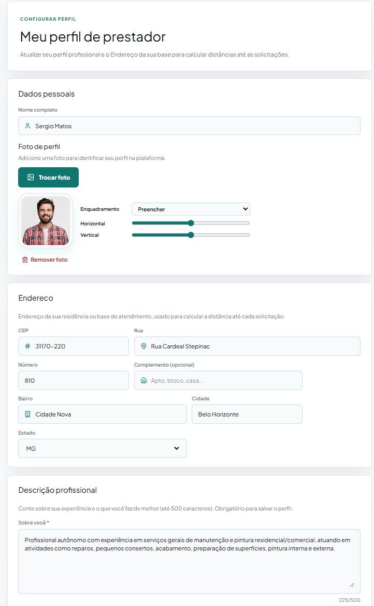
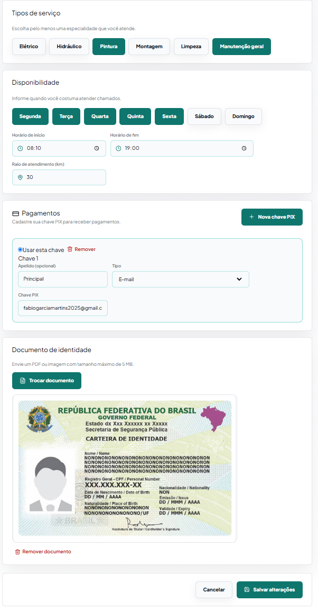

Na tela de configuração do perfil, o prestador de serviço pode cadastrar e atualizar suas informações pessoais e profissionais. Além do nome completo, é possível inserir uma descrição profissional, destacando sua experiência, qualificações e especialidades. O usuário também seleciona as categorias de serviços que realiza, como Elétrica, Hidráulica, Limpeza, Pintura, entre outras.

Adicionalmente, o prestador pode cadastrar seu endereço para facilitar a localização e informar sua chave Pix, que será utilizada para o recebimento de pagamentos pelos serviços prestados. Após o preenchimento ou atualização dos dados, as informações são confirmadas por meio do botão "Salvar alterações"

### 6.3.2. Tela de  de perfil 
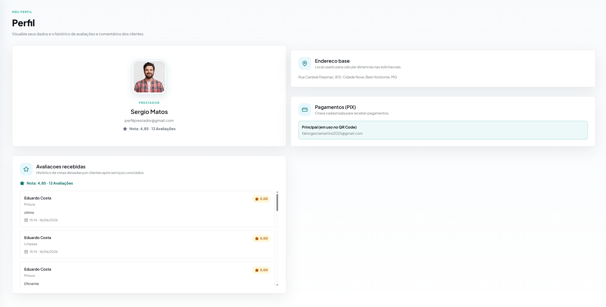

Na tela de perfil são exibidas as principais informações do usuário, incluindo sua foto de perfil, o endereço atualmente cadastrado e as avaliações recebidas. Além disso, a página apresenta os comentários realizados por outros usuários, permitindo visualizar o histórico de feedbacks e a reputação construída na plataforma.

## 6.4. Telas do processo 3 — Solicitação de Serviço

## Cliente

### 6.4.1. Painel do cliente

Após a aprovação do cadastro e a realização do login, o cliente é  direcionado ao seu painel de controle, onde encontra uma visão geral organizada de suas atividades na plataforma. Nesse ambiente, são apresentados resumos importantes, como as solicitações já publicadas, solitações agendandas, o acompanhamento dos gastos mensais e de sua avaliação média. Na área central do painel, o cliente pode visualizar suas solicitações de forma detalhada, com a possibilidade de aplicar filtros por status como concluídas, aguardando aceite ou concluidas facilitando a navegação e o acompanhamento. Além disso, o painel oferece funcionalidades essenciais, como a criação de novas solicitações, a opção de aceitar ou recusar propostas recebidas e o acesso ao histórico completo de serviços realizados. Também é possível gerenciar informações pessoais por meio da área de perfil, garantindo autonomia e praticidade na atualização dos dados do cliente.

### 6.4.2. Criar Solitação

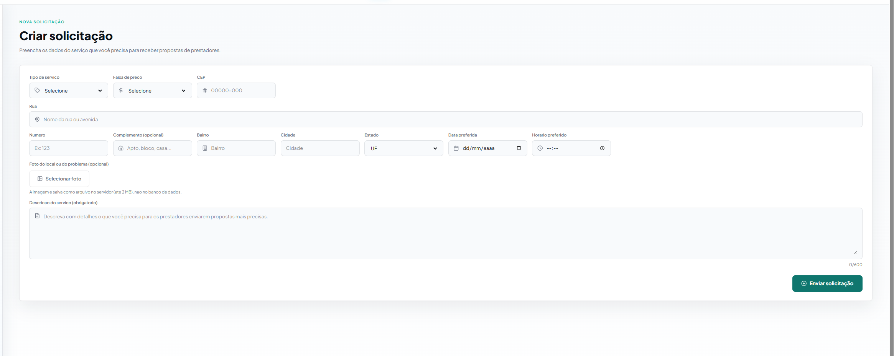
Tela de criação de nova solicitação de serviço pelo cliente. O usuário preenche o título, tipo e descrição do serviço, adiciona fotos opcionais e assim publica a solicitação para que prestadores próximos recebam e enviem propostas. Também é possível salvar como rascunho para publicar depois.

### 6.4.2. Vizualizar Propostas Recebidas

Esta tela permite que o cliente visualize todas as propostas enviadas por prestadores de serviço para as solicitações que ele criou. As propostas possuem  informações relevantes para a tomada de decisão. O cliente pode analisar cada proposta individualmente e optar por aceitar ou recusar. Ao aceitar uma proposta, a solicitação é automaticamente finalizada, impedindo novas interações e consolidando o acordo com o prestador selecionado.

## Prestador

### 6.4.4 Painel do prestador

Após a aprovação do cadastro e login, o prestador é direcionado ao seu painel de controle. O painel apresenta um resumo das principais informações do profissional, incluindo indicadores de desempenho solicitações novas, serviços concluídos no mês, ganhos acumulados e avaliação média. Na seção central, o prestador pode visualizar e filtrar as solicitações de clientes por proximidade, valor, data ou urgência, com informações detalhadas sobre cada serviço, podendo recusar, realizar propostas ou aceitar solicitações. O painel também exibe o histórico de serviços recentes e a barra lateral permite acesso ao gerenciamento do perfil profissional 

### 6.4.5 Vizualizar Propostas Enviadas

Esta tela permite que o prestador visualize todas as propostas que ele enviou para solicitações de clientes. As propostas são listadas com informações relevantes, facilitando o acompanhamento do andamento de cada envio.
Para cada proposta, é exibido o status atual, podendo ser aceita, recusada ou aguardando resposta do cliente. Isso possibilita ao prestador ter uma visão clara das oportunidades em aberto e das negociações já concluídas.

### 6.4.6 Vizualizar Metricas
 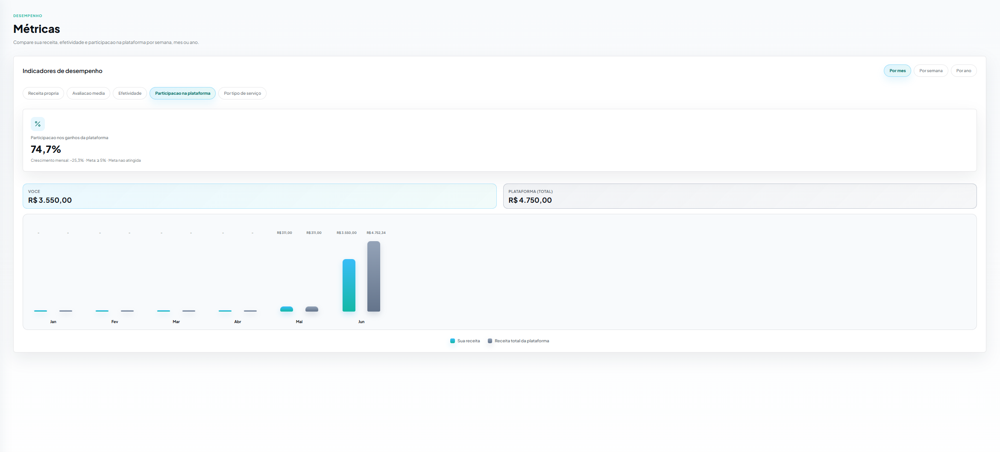

 A tela de visualização de métricas permite que o prestador de serviço acompanhe seu desempenho na plataforma por meio de diferentes indicadores. As informações podem ser filtradas por semana, mês ou ano, possibilitando uma análise detalhada da evolução de suas atividades ao longo do tempo.

Nessa tela, o prestador pode visualizar métricas relacionadas à quantidade de serviços realizados, faturamento obtido, avaliações recebidas e demais indicadores relevantes. Dessa forma, é possível ter uma melhor noção do próprio desempenho, identificar tendências e acompanhar seu crescimento na plataforma, auxiliando na tomada de decisões e na melhoria contínua da qualidade dos serviços prestados.

## Telas Iguais entre os Usuarios

### 6.4.7 Vizualizar Historico Serviços 

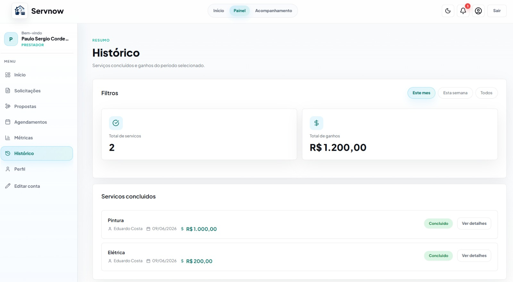

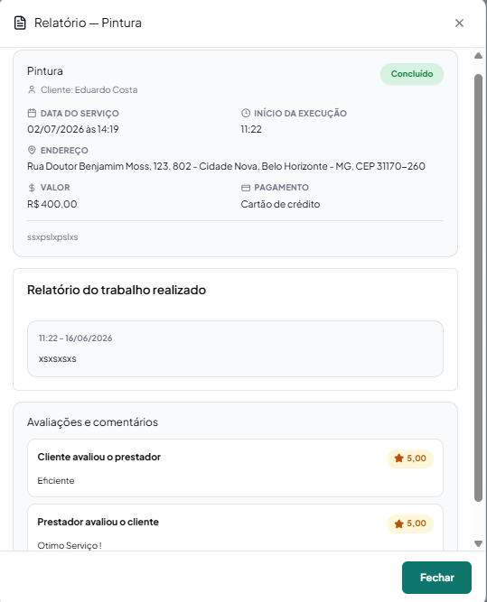

Esta tela apresenta o histórico de serviços concluídos, sendo compartilhada tanto pelo cliente quanto pelo prestador, com a mesma funcionalidade para ambos os perfis. Nela, são exibidas informações relevantes de cada serviço finalizado, como valor cobrado, forma de pagamento utilizada e um relatorio que é aberto em ver detalhes. Além disso, a tela permite visualizar os comentários e avaliações deixados entre as partes.

### 6.4.8 Vizualizar Serviços Agendandos

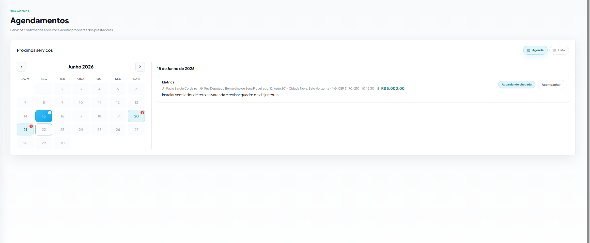
Esta tela reúne os serviços já confirmados e agendados, exibindo data, horário e a outra parte envolvida (cliente ou prestador) em cada atendimento, permitindo o planejamento da agenda de ambos os perfis.

## 6.5. Telas do processo 4 — Acompanhamento do serviço 

### 6.5.1. Tela de confirmação de chegada do prestador

Esta tela tem como objetivo validar a chegada do prestador ao local do cliente de forma segura, utilizando um código de verificação de 4 dígitos. Após aceitar o serviço, o cliente visualiza um código único gerado automaticamente, com validade limitada, que deve ser informado ao prestador no momento da chegada. Ao chegar ao local, o prestador acessa a tela de confirmação de chegada e insere o código fornecido pelo cliente, garantindo que o serviço só seja iniciado com a presença física confirmada no local correto. Após a validação correta do código, o sistema libera automaticamente o início do serviço, avançando o fluxo para a próxima etapa.

## Visão do Prestador

## Visão do Cliente 

### 6.5.2. Tela de acompanhamento da ordem de Serviço 

## Visão do Cliente

Tela onde o cliente acompanha um serviço concluído. Exibe as atualizações enviadas pelo prestador com fotos e descrições do trabalho realizado. Inclui uma seção de avaliação do prestador com estrelas e comentário opcional, e uma seção de pagamento onde o cliente escolhe a forma de pagamento (PIX, Cartão de Crédito ou Débito) e confirma o valor do serviço.

## Visão do Prestador 

Tela onde o prestador de serviço acompanha e gerencia um serviço em andamento. Exibe o nome do serviço, o cliente, horário de início e previsão de término. O prestador pode enviar atualizações em texto e fotos sobre o progresso do trabalho, além de visualizar o histórico de atualizações já enviadas anteriormente.

### 6.5.3. Tela de pagamento
A tela de pagamento permite que o cliente realize a quitação do serviço contratado de maneira simples e segura. Nela, são exibidos o valor total do serviço e as diferentes formas de pagamento disponibilizadas pela plataforma.

O cliente pode efetuar o pagamento diretamente pela plataforma por meio de cartão de crédito e debito, utilizando a integração com o Mercado Pago, ou optar pelo pagamento via Pix. Além disso, também são oferecidas a modalidade de pagamento em dinheiro, permitindo maior flexibilidade na escolha da forma de pagamento.

Após a realização do pagamento, a transação é registrada e o status do serviço é atualizado. Nos casos de pagamento em dinheiro e em PIX realizados presencialmente, o prestador de serviço é responsável por confirmar o recebimento do valor por meio da plataforma. Essa confirmação garante que o pagamento foi efetuado corretamente e permite que o serviço seja finalizado, proporcionando maior transparência e segurança para ambas as partes.

## Visão do Cliente
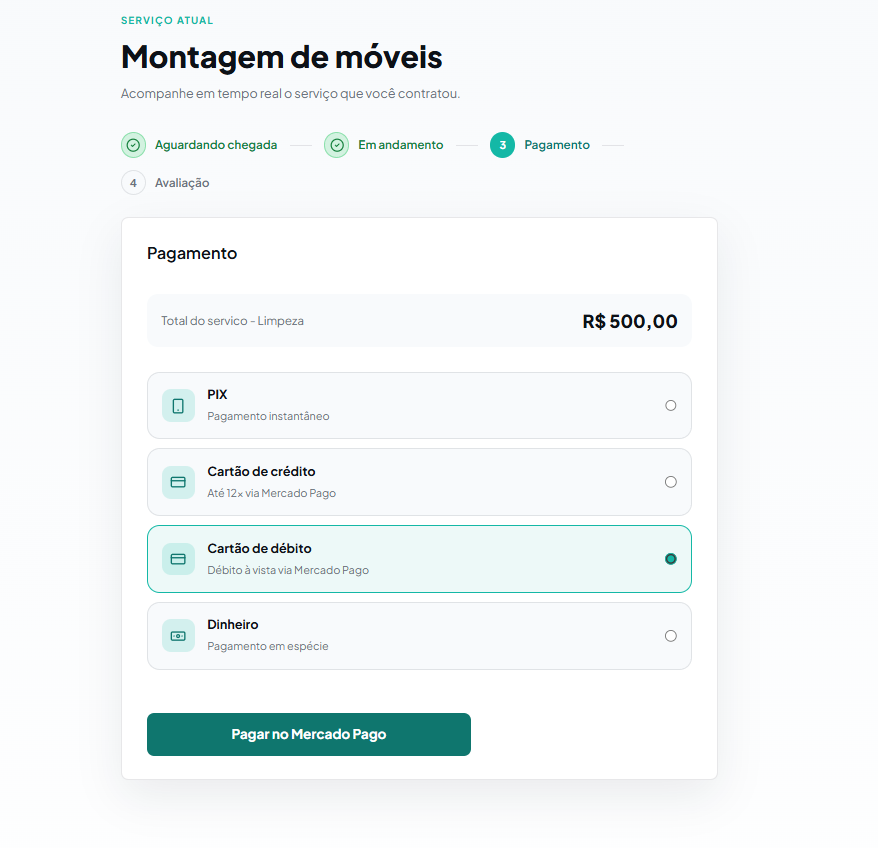

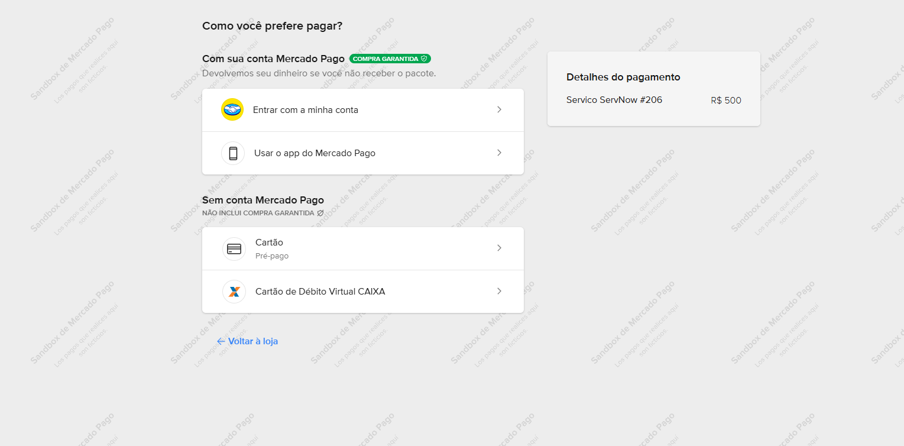

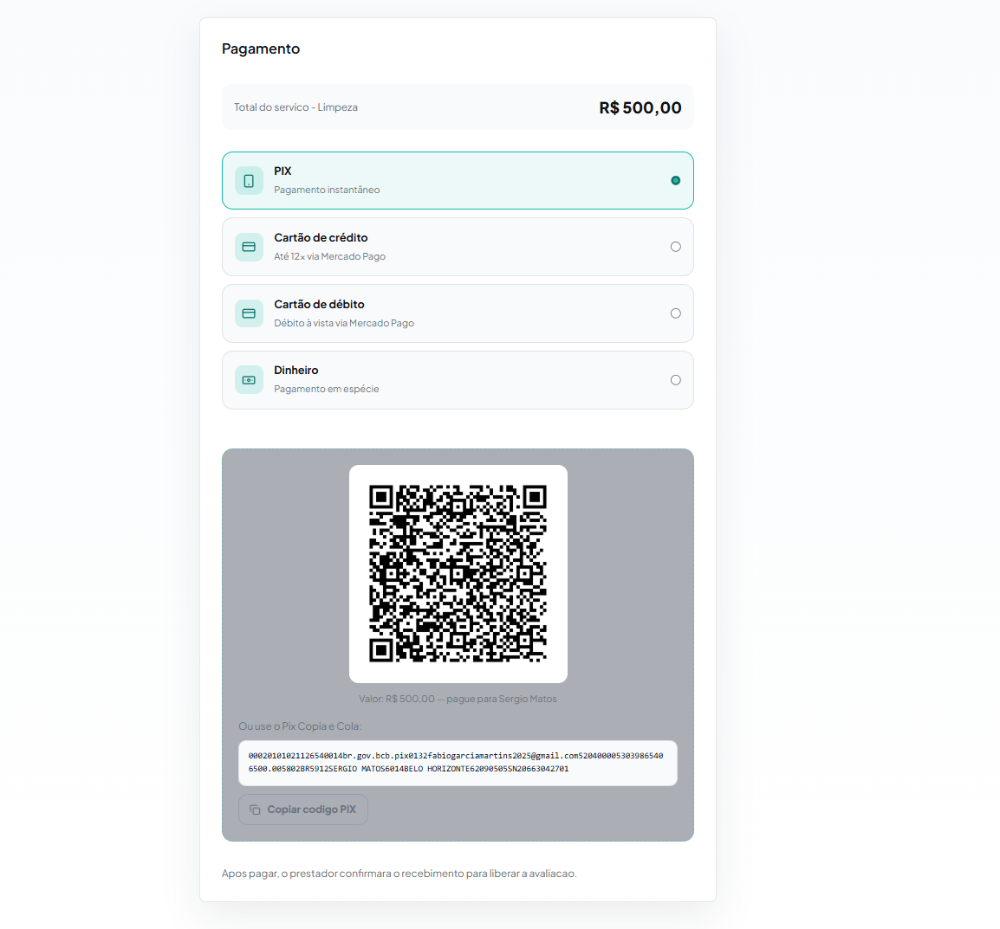

## Visão do Prestador
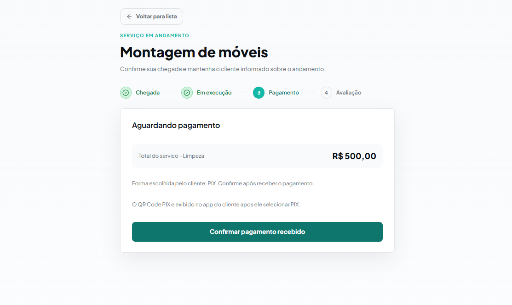

### 6.5.4. Tela de avaliação
Após a conclusão do serviço, cliente e prestador de serviço têm acesso à tela de avaliação, na qual ambos podem atribuir uma nota de 1 a 5 estrelas referente à experiência obtida durante o atendimento. Além da pontuação, os usuários podem registrar comentários descrevendo aspectos positivos, sugestões de melhoria ou observações sobre o serviço realizado.
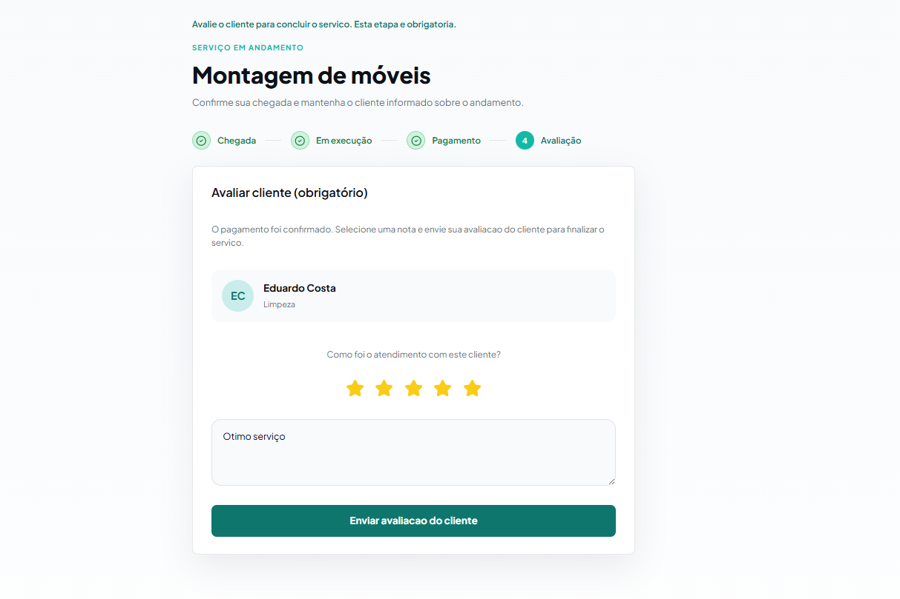
