# 6. Interface do sistema

_Visão geral da interação do usuário por meio das telas do sistema. Abaixo são apresentadas as principais interfaces da plataforma ServNow._

## 6.1. Tela principal do sistema

Na tela da Home Page, serão apresentadas informações gerais sobre a plataforma, explicando de forma clara como ela funciona e qual é o seu propósito.

Também serão exibidas as principais categorias de serviços disponíveis, destacando os tipos de atividades nas quais os prestadores podem se cadastrar e atuar.

Além disso, a página contará com uma seção dedicada às vantagens da plataforma, evidenciando seus benefícios tanto para clientes quanto para prestadores de serviço.

Por fim, serão exibidos feedbacks e avaliações de clientes, com o objetivo de gerar confiança e demonstrar a qualidade dos serviços oferecidos.

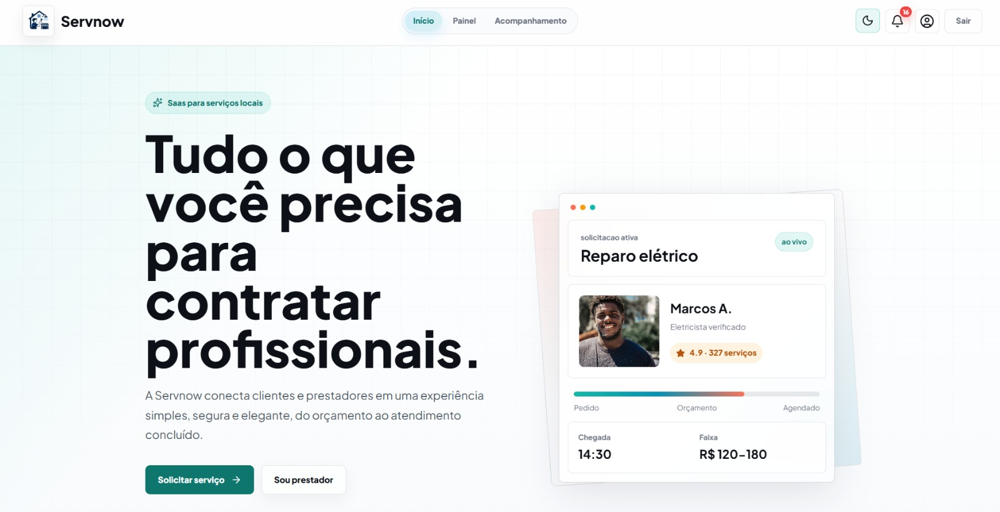

---
## 6.1.2 Tela  de Login
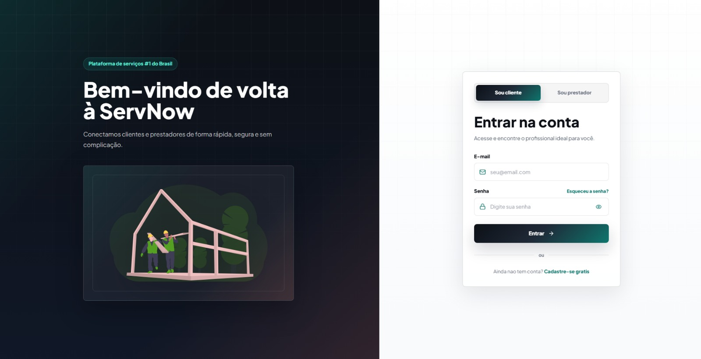

## 6.2. Telas do processo 1 — Gestão de Clientes

Telas referentes ao processo de cadastro, login e configuração de perfil do Cliente na plataforma.

### 6.2.1. Tela de cadastro de cliente

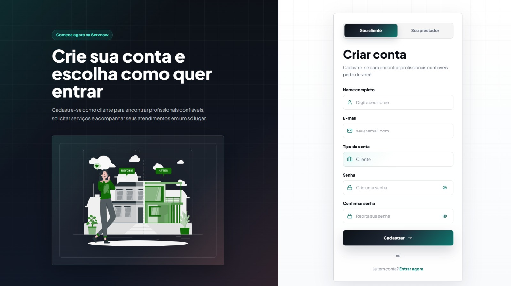

Tela destinada ao cadastro de novos  clientes na plataforma ServNow. Nela, o cliente informa seus dados pessoais (nome, CPF, e-mail, telefone e CEP), e define sua senha de acesso. O layout segue o padrão visual da plataforma, com uma seção ilustrativa à esquerda reforçando os benefícios de se tornar um cliente e o formulário de cadastro à direita. O usuário também pode alternar entre as opções "Sou cliente" e "Sou prestador" no topo do formulário.

### 6.2.2. Tela de configuração de perfil !

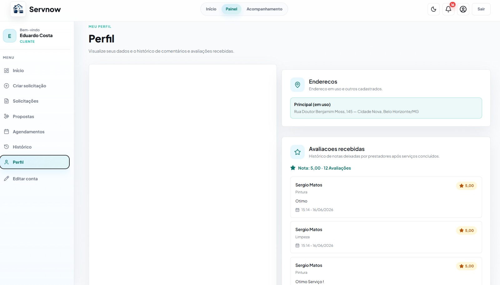

Tela de configuração de perfil do cliente. Permite inserir nome completo, endereço detalhado (rua, número, CEP, bairro, cidade e estado) e uma foto do local/endereço. Ao final, o botão "Salvar alterações" confirma as informações cadastradas.

---

## 6.3. Telas do processo 2 — Gestão de Prestadores

Telas referentes ao processo de cadastro, login e configuração de perfil do Prestador se serviços na plataforma.

### 6.3.1. Tela de cadastro do prestador

Tela destinada ao cadastro de novos prestadores na plataforma ServNow. Nela, o profissional informa seus dados pessoais (nome, CPF, e-mail, telefone e CEP), seleciona sua área de atuação (eletricista, encanador, pintor, etc.) e define sua senha de acesso. O layout segue o padrão visual da plataforma, com uma seção ilustrativa à esquerda reforçando os benefícios de se tornar um prestador e o formulário de cadastro à direita. O usuário também pode alternar entre as opções "Sou cliente" e "Sou prestador" no topo do formulário.

### 6.2.2. Tela de configuração de perfil 

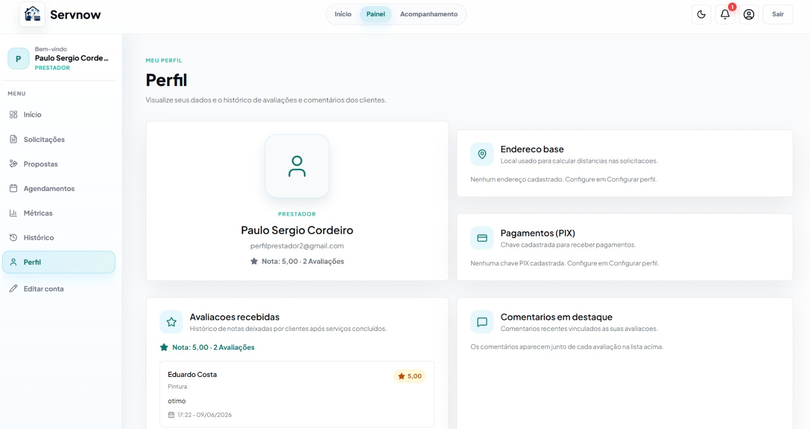

Tela de configuração de perfil do prestador de serviço. Além do nome completo, o prestador preenche uma descrição profissional destacando sua experiência e especialidades, e seleciona os tipos de serviço que realiza (como Elétrico, Hidráulico, Limpeza, Pintura, entre outros). O botão "Salvar alterações" confirma o perfil.

---

## 6.4. Telas do processo 3 — Solicitação de Serviço

## Cliente

### 6.4.1. Painel do cliente

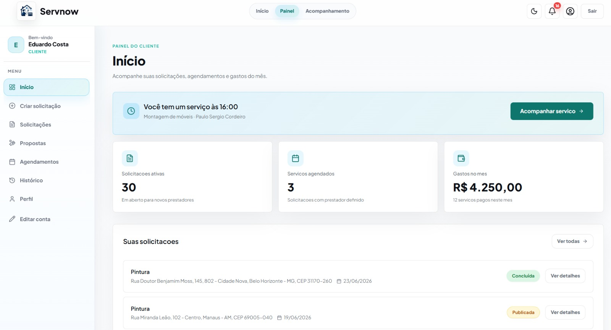

Após a aprovação do cadastro e a realização do login, o cliente é  direcionado ao seu painel de controle, onde encontra uma visão geral organizada de suas atividades na plataforma. Nesse ambiente, são apresentados resumos importantes, como as solicitações já publicadas, solitações agendandas, o acompanhamento dos gastos mensais e de sua avaliação média. Na área central do painel, o cliente pode visualizar suas solicitações de forma detalhada, com a possibilidade de aplicar filtros por status como concluídas, aguardando aceite ou concluidas facilitando a navegação e o acompanhamento. Além disso, o painel oferece funcionalidades essenciais, como a criação de novas solicitações, a opção de aceitar ou recusar propostas recebidas e o acesso ao histórico completo de serviços realizados. Também é possível gerenciar informações pessoais por meio da área de perfil, garantindo autonomia e praticidade na atualização dos dados do cliente.

### 6.4.2. Criar Solitação

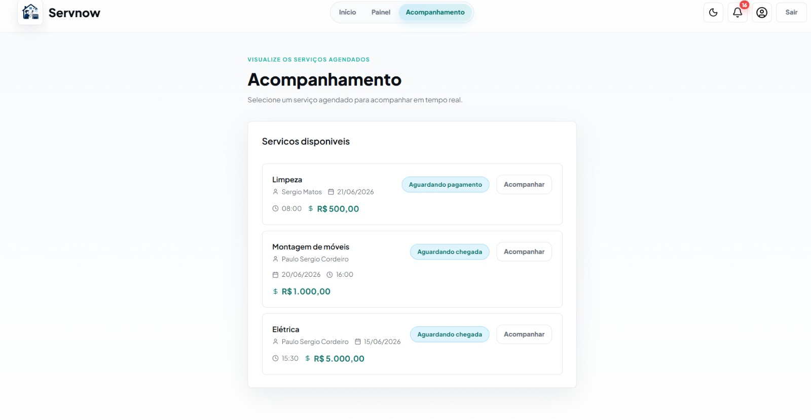
Tela de criação de nova solicitação de serviço pelo cliente. O usuário preenche o título, tipo e descrição do serviço, adiciona fotos opcionais e assim publica a solicitação para que prestadores próximos recebam e enviem propostas. Também é possível salvar como rascunho para publicar depois.

### 6.4.2. Vizualizar Propostas Recebidas

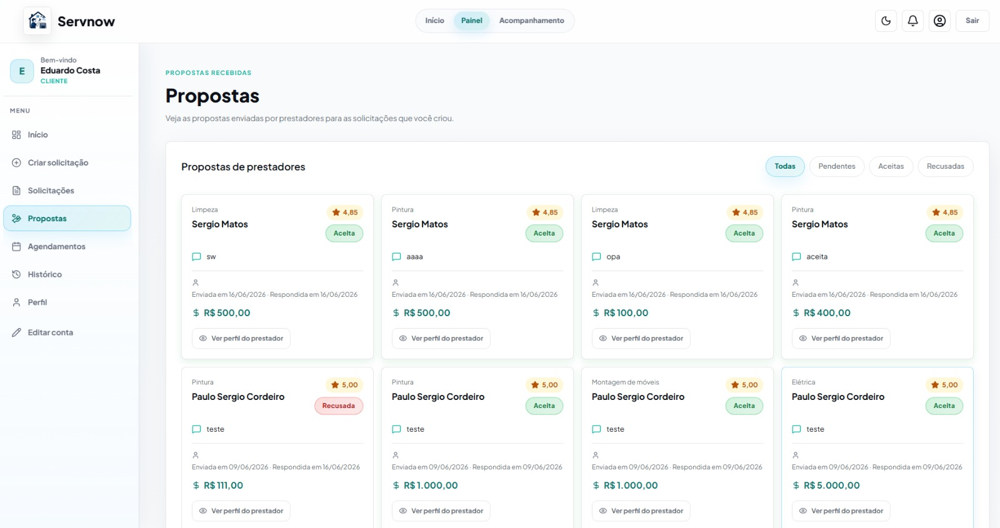

Esta tela permite que o cliente visualize todas as propostas enviadas por prestadores de serviço para as solicitações que ele criou. As propostas possuem  informações relevantes para a tomada de decisão. O cliente pode analisar cada proposta individualmente e optar por aceitar ou recusar. Ao aceitar uma proposta, a solicitação é automaticamente finalizada, impedindo novas interações e consolidando o acordo com o prestador selecionado.

## Prestador

### 6.4.4 Painel do prestador

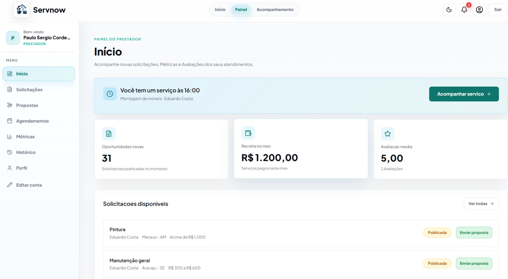

Após a aprovação do cadastro e login, o prestador é direcionado ao seu painel de controle. O painel apresenta um resumo das principais informações do profissional, incluindo indicadores de desempenho solicitações novas, serviços concluídos no mês, ganhos acumulados e avaliação média. Na seção central, o prestador pode visualizar e filtrar as solicitações de clientes por proximidade, valor, data ou urgência, com informações detalhadas sobre cada serviço, podendo recusar, realizar propostas ou aceitar solicitações. O painel também exibe o histórico de serviços recentes e a barra lateral permite acesso ao gerenciamento do perfil profissional 

### 6.4.5 Vizualizar Propostas Enviadas

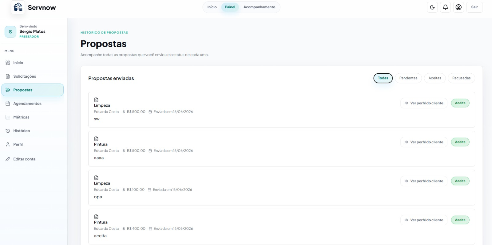

Esta tela permite que o prestador visualize todas as propostas que ele enviou para solicitações de clientes. As propostas são listadas com informações relevantes, facilitando o acompanhamento do andamento de cada envio.
Para cada proposta, é exibido o status atual, podendo ser aceita, recusada ou aguardando resposta do cliente. Isso possibilita ao prestador ter uma visão clara das oportunidades em aberto e das negociações já concluídas.

## Telas Iguais entre os Usuarios

### 6.4.6 Vizualizar Historico Serviços [Historico de Serviços](images/design/Historico.jpeg)

Esta tela apresenta o histórico de serviços concluídos, sendo compartilhada tanto pelo cliente quanto pelo prestador, com a mesma funcionalidade para ambos os perfis. Nela, são exibidas informações relevantes de cada serviço finalizado, como valor cobrado, forma de pagamento utilizada e um relatorio que é aberto em ver detalhes. Além disso, a tela permite visualizar os comentários e avaliações deixados entre as partes.

### 6.4.7 Vizualizar Serviços Agendandos

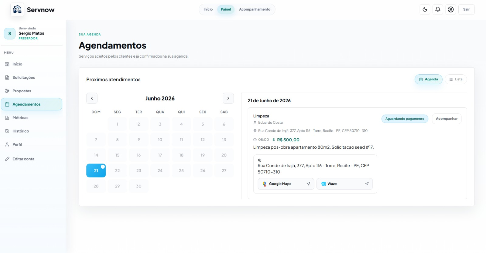

Esta tela reúne os serviços já confirmados e agendados, exibindo data, horário e a outra parte envolvida (cliente ou prestador) em cada atendimento, permitindo o planejamento da agenda de ambos os perfis.

## 6.5. Telas do processo 4 — Acompanhamento do serviço 

### 6.5.1. Tela de confirmação de chegada do prestador

Esta tela tem como objetivo validar a chegada do prestador ao local do cliente de forma segura, utilizando um código de verificação de 4 dígitos. Após aceitar o serviço, o cliente visualiza um código único gerado automaticamente, com validade limitada, que deve ser informado ao prestador no momento da chegada. Ao chegar ao local, o prestador acessa a tela de confirmação de chegada e insere o código fornecido pelo cliente, garantindo que o serviço só seja iniciado com a presença física confirmada no local correto. Após a validação correta do código, o sistema libera automaticamente o início do serviço, avançando o fluxo para a próxima etapa.

Visão do Prestador
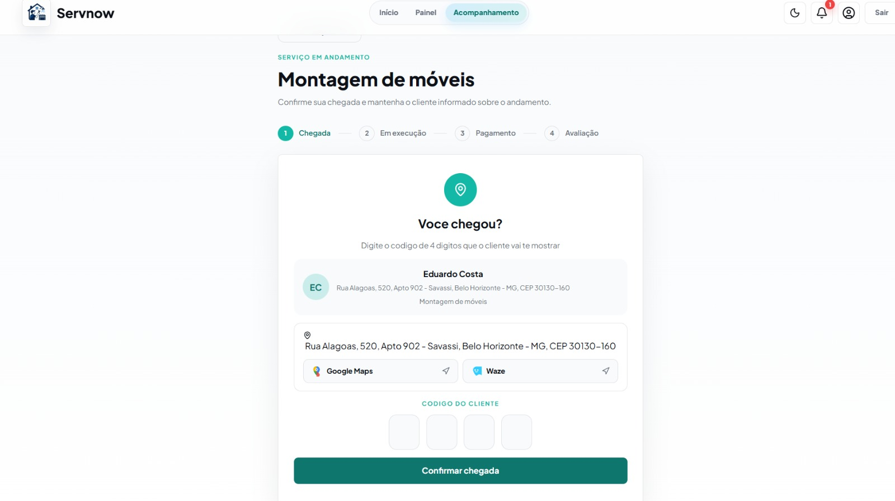

Visão do Cliente 
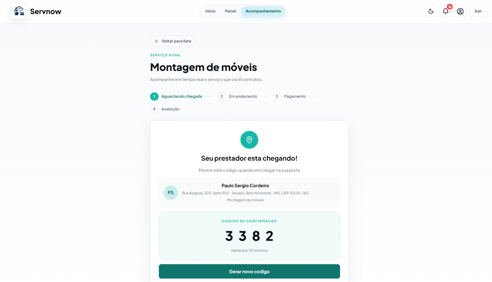

### 6.5.2. Tela de acompanhamento da ordem de Serviço 

Visão do Cliente
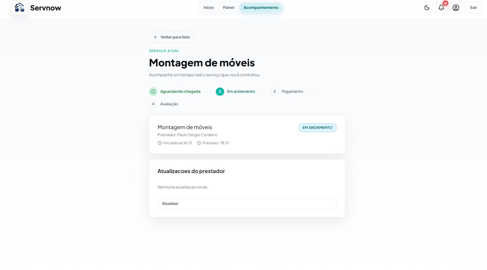
Tela onde o cliente acompanha um serviço concluído. Exibe as atualizações enviadas pelo prestador com fotos e descrições do trabalho realizado. Inclui uma seção de avaliação do prestador com estrelas e comentário opcional, e uma seção de pagamento onde o cliente escolhe a forma de pagamento (PIX, Cartão de Crédito ou Débito) e confirma o valor do serviço.

Visão do Prestador 
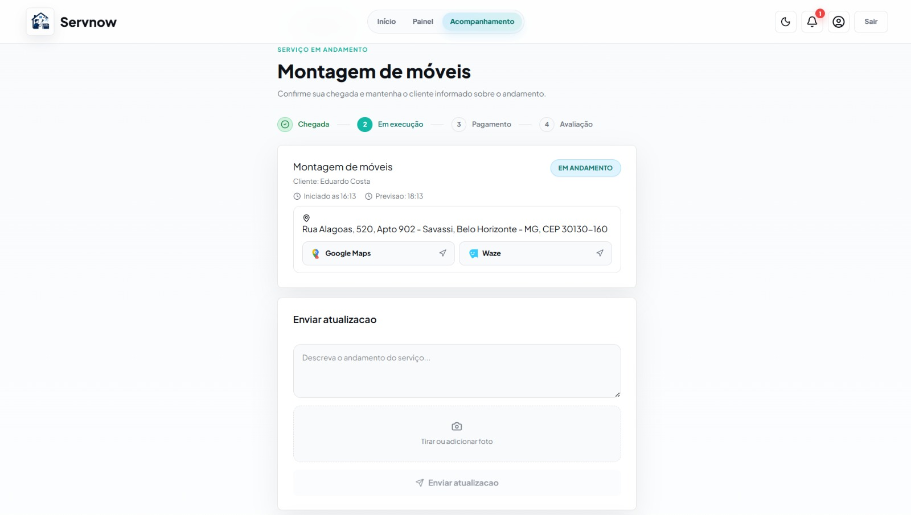
Tela onde o prestador de serviço acompanha e gerencia um serviço em andamento. Exibe o nome do serviço, o cliente, horário de início e previsão de término. O prestador pode enviar atualizações em texto e fotos sobre o progresso do trabalho, além de visualizar o histórico de atualizações já enviadas anteriormente.

