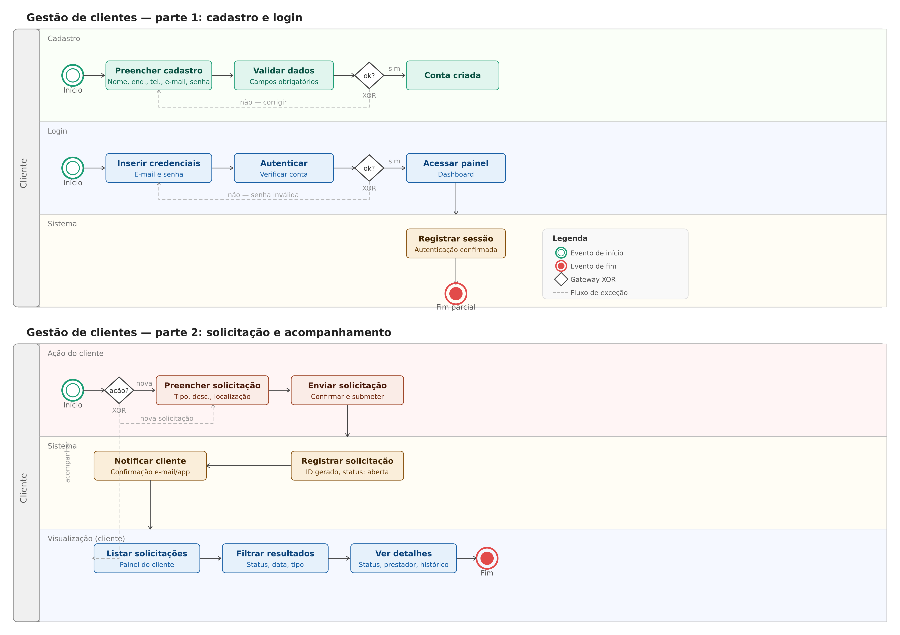

### 3.3.1 Processo 1 – Gestão de Clientes

O processo de gestão de clientes abrange desde o cadastro e autenticação na plataforma até a solicitação e acompanhamento de serviços residenciais. Atualmente, sem um sistema centralizado, o cliente depende de contatos informais e não tem visibilidade sobre o status do seu atendimento.

A oportunidade de melhoria está em oferecer ao cliente uma jornada digital completa: criar sua conta, autenticar-se com segurança, solicitar serviços informando tipo, descrição e localização, e acompanhar em tempo real o status de cada solicitação pelo painel da plataforma ServNow.

---

#### Detalhamento das atividades

Os tipos de dados utilizados nas atividades são:

* **Área de texto** - campo texto de múltiplas linhas
* **Caixa de texto** - campo texto de uma linha
* **Número** - campo numérico
* **Data** - campo do tipo data (dd-mm-aaaa)
* **Hora** - campo do tipo hora (hh:mm:ss)
* **Data e Hora** - campo do tipo data e hora (dd-mm-aaaa, hh:mm:ss)
* **Imagem** - campo contendo uma imagem
* **Seleção única** - campo com várias opções de valores que são mutuamente exclusivas (radio button ou combobox)
* **Seleção múltipla** - campo com várias opções que podem ser selecionadas mutuamente (checkbox ou listbox)
* **Arquivo** - campo de upload de documento
* **Link** - campo que armazena uma URL
* **Tabela** - campo formado por uma matriz de valores

---

## Parte 1 – Cadastro e Login

---

**Preencher cadastro**

| **Campo**       | **Tipo**        | **Restrições**                          | **Valor default** |
| ---             | ---             | ---                                     | ---               |
| Nome completo   | Caixa de texto  | mínimo de 3 caracteres                  |                   |
| Endereço        | Caixa de texto  | logradouro, número, bairro, cidade, CEP |                   |
| Telefone        | Caixa de texto  | formato (00) 00000-0000                 |                   |
| E-mail          | Caixa de texto  | formato de e-mail válido, único         |                   |
| Senha           | Caixa de texto  | mínimo de 8 caracteres                  |                   |

| **Comandos**    | **Destino**                        | **Tipo**  |
| ---             | ---                                | ---       |
| Cadastrar       | Validar dados (sistema)            | default   |
| Cancelar        | Tela inicial                       | cancel    |

---

**Validar dados**

Atividade executada automaticamente pelo sistema. Verifica se todos os campos obrigatórios foram preenchidos corretamente e se o e-mail informado ainda não está cadastrado.

| **Campo**             | **Tipo**       | **Restrições**  | **Valor default** |
| ---                   | ---            | ---             | ---               |
| Resultado da validação | Seleção única | ok / erro       | —                 |
| Mensagem de erro      | Área de texto  | somente leitura |                   |

| **Comandos**    | **Destino**                         | **Tipo**  |
| ---             | ---                                 | ---       |
| *(automático)*  | Conta criada — se ok                | default   |
| *(automático)*  | Preencher cadastro — se erro        | cancel    |

---

**Inserir credenciais**

| **Campo** | **Tipo**       | **Restrições**           | **Valor default** |
| ---       | ---            | ---                      | ---               |
| E-mail    | Caixa de texto | formato de e-mail válido |                   |
| Senha     | Caixa de texto | mínimo de 8 caracteres   |                   |

| **Comandos**     | **Destino**                  | **Tipo**  |
| ---              | ---                          | ---       |
| Entrar           | Autenticar (sistema)         | default   |
| Esqueci a senha  | Processo de recuperação      | cancel    |

---

**Autenticar**

Atividade executada automaticamente pelo sistema. Verifica se o e-mail existe e se a senha informada corresponde ao cadastro.

| **Campo**              | **Tipo**       | **Restrições**  | **Valor default** |
| ---                    | ---            | ---             | ---               |
| Resultado da autenticação | Seleção única | ok / erro     | —                 |
| Mensagem de erro       | Área de texto  | somente leitura |                   |

| **Comandos**   | **Destino**                          | **Tipo**  |
| ---            | ---                                  | ---       |
| *(automático)* | Acessar painel — se ok               | default   |
| *(automático)* | Inserir credenciais — se senha inválida | cancel |

---

**Acessar painel (Dashboard)**

Tela principal do cliente após autenticação bem-sucedida. Exibe resumo das solicitações ativas e acesso às funcionalidades da plataforma.

| **Campo**              | **Tipo**  | **Restrições**  | **Valor default** |
| ---                    | ---       | ---             | ---               |
| Nome do cliente        | Caixa de texto | somente leitura |              |
| Solicitações ativas    | Tabela    | somente leitura |                   |
| Notificações recentes  | Tabela    | somente leitura |                   |

| **Comandos**          | **Destino**                    | **Tipo**  |
| ---                   | ---                            | ---       |
| Nova solicitação      | Preencher solicitação          | default   |
| Ver minhas solicitações | Listar solicitações          | default   |
| Sair                  | Tela de login                  | cancel    |

---

