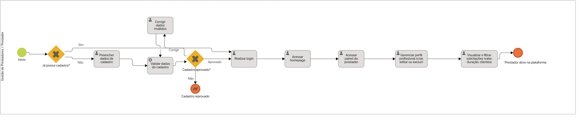

### 3.3.2 Processo 2 – Gestão de Prestadores

Atualmente, não existe uma plataforma centralizada para visualização e gerenciamento de prestadores de serviço. Os profissionais dependem, em grande parte, de indicações informais para conseguir novos clientes, o que limitaseu alcance e dificulta o crescimento profissional. Esse cenário gera insegurança, comunicação desorganizada e falta de transparência durante todo o processo de contratação e execução do serviço.

A oportunidade de melhoria está na centralização de todo esse ciclo por meio da plataforma ServNow. Com ela, os prestadores poderão se cadastrar de forma padronizada, com validação de dados e identidade, aumentando a confiança no serviço oferecido.

---

#### Detalhamento das atividades

Os tipos de dados utilizados nas atividades são:

* **Área de texto** - campo texto de múltiplas linhas
* **Caixa de texto** - campo texto de uma linha
* **Número** - campo numérico
* **Data** - campo do tipo data (dd-mm-aaaa)
* **Hora** - campo do tipo hora (hh:mm:ss)
* **Data e Hora** - campo do tipo data e hora (dd-mm-aaaa, hh:mm:ss)
* **Imagem** - campo contendo uma imagem
* **Seleção única** - campo com várias opções de valores que são mutuamente exclusivas (radio button ou combobox)
* **Seleção múltipla** - campo com várias opções que podem ser selecionadas mutuamente (checkbox ou listbox)
* **Arquivo** - campo de upload de documento
* **Link** - campo que armazena uma URL
* **Tabela** - campo formado por uma matriz de valores

---

### Preencher cadastro

| Campo           | Tipo            | Restrições                                                                 | Valor default |
|------------------|-----------------|----------------------------------------------------------------------------|---------------|
| Nome completo    | Caixa de texto  | mínimo de 10 caracteres                                                   |               |
| Endereço         | Caixa de texto  | logradouro, número, bairro, cidade, CEP                                  |               |
| Telefone         | Caixa de texto  | formato (XX) 00000-0000                                                   |               |
| E-mail           | Caixa de texto  | formato de e-mail válido, único                                           |               |
| Senha            | Caixa de texto  | mínimo de 8 caracteres, pelo menos 1 letra maiúscula, 1 número e 1 caractere especial |               |

| Comandos         | Destino                        | Tipo    |
|------------------|--------------------------------|---------|
| Cadastrar        | Validar dados (sistema)       | default |
| Cancelar         | Home page                     | cancel  |

**Inserir credenciais**

| **Campo** | **Tipo**       | **Restrições**           | **Valor default** |
| ---       | ---            | ---                      | ---               |
| E-mail    | Caixa de texto | formato de e-mail válido |                   |
| Senha     | Caixa de texto | mínimo de 8 caracteres   |                   |

| **Comandos**     | **Destino**                  | **Tipo**  |
| ---              | ---                          | ---       |
| Entrar           | Autenticar (sistema)         | default   |
| Esqueci a senha  | Processo de recuperação      | cancel    |

### Configurar perfil e disponibilidade

| Campo                      | Tipo               | Restrições                                      | Valor default |
|----------------------------|--------------------|-------------------------------------------------|---------------|
| Descrição profissional     | Área de texto      | máximo de 500 caracteres                        |               |
| Preço médio por serviço    | Número             | valor positivo, em R$                           |               |
| Dias disponíveis           | Seleção múltipla   | pelo menos 1 dia selecionado                    |               |
| Horário de início          | Hora               | anterior ao horário de fim                      |               |
| Horário de fim             | Hora               | posterior ao horário de início                  |               |
| Raio de atendimento (km)   | Número             | entre 1 e 100                                   | 10            |
| Documento de identidade    | Arquivo            | PDF ou imagem, máximo de 5 MB                   |               |
| Foto de perfil             | Imagem             | JPG ou PNG, máximo de 2 MB                      |               |

| Comandos        | Destino                                 | Tipo    |
|-----------------|-----------------------------------------|---------|
| Salvar perfil   | Aguardar solicitações (fila do sistema) | default |
| Editar depois   | Painel do prestador                     | cancel  |
