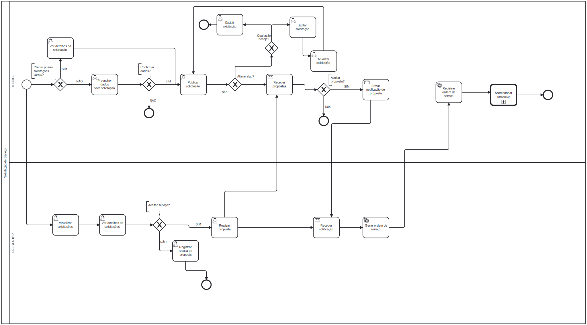

### 3.3.3 Processo 3 –SOLICITAR SERVIÇO

 cliente cadastra de forma estruturada o tipo de serviço, a descrição do problema, o endereço, a data/horário desejados e fotos opcionais; revisa e confirma o envio na plataforma. A solicitação é publicada e o prestador consulta as oportunidades, analisa os detalhes e envia propostas (valor e mensagem) ou pode recusar participar. O cliente acompanha todas as solicitações no painel, com filtros, status e detalhes; compara e aceita uma proposta, o que agenda o serviço (vincula prestador, valor e data/horário). Solicitações recusadas ou sem proposta aceita permanecem em aberto ou encerradas conforme o fluxo. Após o agendamento, o processo segue para o Processo 4 

#### Detalhamento das atividades Cliente

**Preencher solicitação**

| Campo                 | Tipo           | Restrições                                   |
| --------------------- | -------------- | -------------------------------------------- |
| Tipo de serviço       | Seleção única  | obrigatório (ex: elétrico, hidráulico, etc.) |
| Descrição do problema | Área de texto  | mínimo de 20 caracteres, máximo de 500       |
| Endereço do serviço   | Caixa de texto | CEP válido, logradouro e número              |
| Horário desejado      | Hora           | dentro do horário de operação da plataforma  |
| Fotos do problema     | Imagem         | opcional, JPG ou PNG, até 3 imagens          |

| Comando            | Destino                        | Tipo    |
| ------------------ | ------------------------------ | ------- |
| Enviar solicitação | Enviar solicitação (confirmar) | default |
| Cancelar           | Painel do cliente              | cancel  |

---

**Enviar solicitação**

Tela de revisão e confirmação antes de submeter a solicitação à plataforma.

| **Campo**           | **Tipo**       | **Restrições**     | 
| ---                 | ---            | ---                | 
| Resumo da solicitação | Área de texto | somente leitura   |                 
| Confirmação         | Seleção única  | Confirmar / Editar |               

| **Comandos**    | **Destino**                        | **Tipo**  |
| ---             | ---                                | ---       |
| Confirmar       | Registrar solicitação (sistema)    | default   |
| Editar          | Preencher solicitação              | cancel    |

---

**Listar solicitações**

Painel de acompanhamento de todas as solicitações do cliente.

| Campo                 | Tipo           | Restrições                                          |
| --------------------- | -------------- | --------------------------------------------------- |
| Lista de solicitações | Tabela         | somente leitura                                     |
| ID da solicitação     | Caixa de texto | somente leitura                                     |
| Tipo de serviço       | Caixa de texto | somente leitura                                     |
| Status                | Caixa de texto | somente leitura (aceita / em andamento / concluída) |
| Data de criação       | Data           | somente leitura                                     |

                                                  
| Comando          | Destino                     |
| ---------------- | ---------------------       |
| Filtrar          | Filtrar resultados          |
| Ver detalhes     | Ver detalhes                |
| Nova solicitação | Preencher solicitação       |
| Aplicar        | Listar solicitações | default |
| Limpar filtros | Listar solicitações | cancel  |

---

**Ver detalhes Cliente**

| Campo                     | Tipo           | Restrições      | Valor |
| ------------------------- | -------------- | --------------- | ----- |
| ID da solicitação         | Caixa de texto | somente leitura |       |
| Status atual              | Caixa de texto | somente leitura |       |
| Nome do prestador         | Caixa de texto | somente leitura |       |
| Avaliação do prestador    | Número         | 0 a 5 estrelas  |       |
| Histórico de  serviços    | Tabela         | somente leitura |       |
| Data e hora do serviço    | Data e Hora    | somente leitura |       |

| **Comandos**        | **Destino**           | **Tipo**  |
| ---                 | ---                   | ---       |
| Voltar              | Listar solicitações   | cancel    |

#### Detalhamento das atividades Prestador

 **Visualizar solicitações (Prestador)**
| Campo                   | Tipo           | Restrições                                     |
| ----------------------- | -------------- | ---------------------------------------------- |
| Lista de solicitações   | Tabela         | somente leitura                                |
| ID da solicitação       | Caixa de texto | somente leitura                                |
| Tipo de serviço         | Caixa de texto | somente leitura                                |
| Descrição do problema   | Área de texto  | somente leitura (resumo)                       |
| Endereço do serviço     | Caixa de texto | somente leitura                                |
| Data e horário desejado | Data e Hora    | somente leitura                                |
| Status                  | Caixa de texto | somente leitura (pendente / aceita / recusada) |

| Comando      | Destino                  | Tipo    |
| ------------ | ------------------------ | ------- |
| Filtrar      | Filtrar solicitações     | default |
| Ver detalhes | Ver detalhes (prestador) | default |
| Aceitar      | Aceitar solicitação      | default |
| Recusar      | Recusar solicitação      | cancel  |

**Ver detalhes Prestador**
| Campo                   | Tipo           | Restrições      |
| ----------------------- | -------------- | --------------- |
| ID da solicitação       | Caixa de texto | somente leitura |
| Tipo de serviço         | Caixa de texto | somente leitura |
| Descrição do problema   | Área de texto  | somente leitura |
| Endereço do serviço     | Caixa de texto | somente leitura |
| Fotos do problema       | Imagem         | somente leitura |
| Data e horário desejado | Data e Hora    | somente leitura |
| Nome do cliente         | Caixa de texto | somente leitura |

| Comando | Destino             | Tipo    |
| ------- | ------------------- | ------- |
| Aceitar | Confirmar aceite    | default |
| Recusar | Confirmar recusa    | cancel  |
| Voltar  | Listar solicitações | cancel  |

**Aceitar solicitação**
| Campo             | Tipo          | Restrições           |
| ----------------- | ------------- | -------------------- |
| Confirmação       | Seleção única | Confirmar / Cancelar |

| Comando   | Destino                        | Tipo    |
| --------- | ------------------------------ | ------- |
| Confirmar | Atualizar status para "aceita" | default |
| Cancelar  | Voltar para detalhes           | cancel  |

**Recusar solicitação**
| Campo            | Tipo          | Restrições                 |
| ---------------- | ------------- | -------------------------- |
| Motivo da recusa | Área de texto | obrigatório, até 300 chars |

| Comando   | Destino                          | Tipo    |
| --------- | -------------------------------- | ------- |
| Confirmar | Atualizar status para "recusada" | default |
| Cancelar  | Voltar para detalhes             | cancel  |
