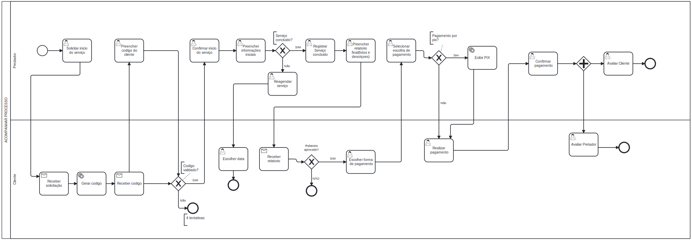

### 3.3.4 Processo 4 – ACOMPANHAMENTO DO SERVIÇO

após o agendamento (Processo 3), o prestador solicita o início do atendimento e o sistema gera um código de verificação para o cliente confirmar a chegada do profissional. Antes de informar o código, o prestador passa por **verificação facial**: uma selfie ao vivo é comparada com a foto de perfil cadastrada (biblioteca face-api no navegador); o servidor registra apenas o resultado (similaridade e data), sem armazenar a selfie (LGPD). Com o código validado, o prestador registra o início do serviço (fotos e observações do estado inicial) e pode enviar atualizações com fotos e descrições durante a execução, enquanto o cliente acompanha em tempo real. Ao concluir, o prestador informa o valor final, fotos do estado final e encaminha a cobrança. O cliente revisa o trabalho executado, aceita e paga (PIX com QR/copia-e-cola, cartão ou débito) ou contesta o valor. Após a confirmação do pagamento, os usuarios se avaliam  (nota e comentário), encerrando a ordem de serviço e atualizando a reputação na plataforma.

Modelo BPMN do Processo 4 

#### Detalhamento das atividades

---

## 1-Solicitar início do serviço

### Campos

| Campo                  | Tipo   | Restrições                                              | 
|------------------------|--------|---------------------------------------------------------|
| Código de verificação  | Número | 4 dígitos, gerado automaticamente, válido por 30 minutos| 

### Comandos

| Comando           | Destino                         | Tipo    |
|------------------ |---------------------------------|---------|
| Confirmar chegada | Gerar e enviar código ao cliente| default |
| Cancelar          | Cancelar atendimento            | cancel  |

---

## 1.1-Verificação facial do prestador

### Campos

| Campo              | Tipo    | Restrições                                                                 |
|--------------------|---------|----------------------------------------------------------------------------|
| Selfie ao vivo     | Imagem  | Capturada pela câmera do dispositivo; não persistida no servidor           |
| Foto de perfil     | Imagem  | Referência já cadastrada no perfil do prestador                            |
| Similaridade (%)   | Número  | Calculada no navegador; mínimo configurável (padrão 55%) para aprovação   |

### Comandos

| Comando              | Destino                              | Tipo    |
|----------------------|--------------------------------------|---------|
| Verificar identidade | Habilitar confirmação do código      | default |
| Tentar novamente     | Nova captura se similaridade baixa   | button  |

---

## 2-Receber codigo e enviar codigo

### Campos

| Campo                | Tipo   | Restrições                 |
|----------------------|--------|----------------------------|
| Nome do prestador    | Texto  | Somente leitura            |
| Serviço contratado   | Texto  | Somente leitura            | 
| Código de verificação| Número | 6 dígitos, obrigatório     | 

### Comandos

| Comando                   | Destino                         | Tipo    |
|---------------------------|---------------------------------|---------|
| Confirmar e enviar código | Prestador insere código         | button  |
| Reenviar código           | Gerar novo código ao cliente    | button  |
| Recusar presença          | Cancelar atendimento            | cancel  |

##  3- Registrar inicio do Serviço

### Campos

| Campo                    | Tipo    | Restrições                                       | 
|--------------------------|---------|--------------------------------------------------|
| Hora de início           | Hora    | Preenchido automaticamente pelo sistema          | 
| Fotos do estado inicial  | Imagem  | JPG/PNG, até 5 imagens, máx. 3MB cada            | 
| Observações do serviço   | Texto   | Máximo de 300 caracteres                         |  
  

### Comandos

| Comando            | Destino                         | Tipo    |
|--------------------|  ------------------------       |---------|
| Enviar             | Envio de dados para o cliente   |button   |

---

##  4- Registrar Serviço concluido

### Campos

| Campo                  | Tipo    | Restrições                     | 
|------------------------|---------|--------------------------------|
| Hora de conclusão      | Hora    | Preenchido automaticamente     | 
| Valor final cobrado    | Número  | Valor positivo (R$)            | 
| Método de pagamento    | Seleção | Pix / Cartão / Dinheiro        |
| Fotos do estado final    | Imagem  | JPG/PNG, até 5 imagens,      | 
| Observações do serviço   | Texto   | Máximo de 300 caracteres     |   
    

### Comandos

| Comando                    | Destino              | Tipo    |
|-------------------------- -|----------------------|---------|
| Concluir                   | Notificar cliente    | button  |
| Enviar cobrança ao cliente | Notificar cliente    | default |

---

##  5-Revisar serviço executado

### Campos

| Campo                    | Tipo    | Restrições        | 
|--------------------------|---------|-------------------|
| Fotos do estado inicial  | Imagem  | Somente leitura   | 
| Fotos do estado final    | Imagem  | Somente leitura   | 
| Observações do prestador | Texto   | Somente leitura   | 
| Valor cobrado            | Número  | Somente leitura   | 

### Comandos

| Comando            | Destino                            | Tipo    |
|--------------------|------------------------------------|---------|
| Aceitar e pagar    | Processar pagamento                | button  |
| Contestar valor    | Notificar prestador                | cancel  |

---

##  7- Processar pagamento

### Campos

| Campo               | Tipo    | Restrições                   | 
|---------------------|---------|------------------------------|
| Método de pagamento | Seleção | Pix / Cartão / Dinheiro      | 
| Valor a pagar       | Número  | Somente leitura              | 
| Status do pagamento | Texto   | Preenchido automaticamente   | 

### Comandos

| Comando             | Destino                                  | Tipo    |
|---------------------|------------------------------------------|---------|
| Confirmar pagamento | Emitir comprovante e encerrar OS         | default |
| Tentar novamente    | Selecionar método de pagamento           | default |
| Cancelar            | Revisar serviço executado                | cancel  |

---

##  8- Avaliar atendimento

### Campos

| Campo               | Tipo     | Restrições                           | 
|---------------------|----------|--------------------------------------|
| Nota                | Seleção  | 1 a 5 estrelas, obrigatório          | 
| Comentário          | Texto    | Máx. 200 caracteres, opcional        | 
| Prazo para avaliação| Hora     | Até 48h após encerramento da OS      | 

### Comandos

| Comando            | Destino                                    | Tipo    |
|--------------------|--------------------------------------------|---------|
| Enviar avaliação   | Registrar e atualizar reputação            | default |
| Pular avaliação    | Registrar OS sem avaliação                 | cancel  |

---
