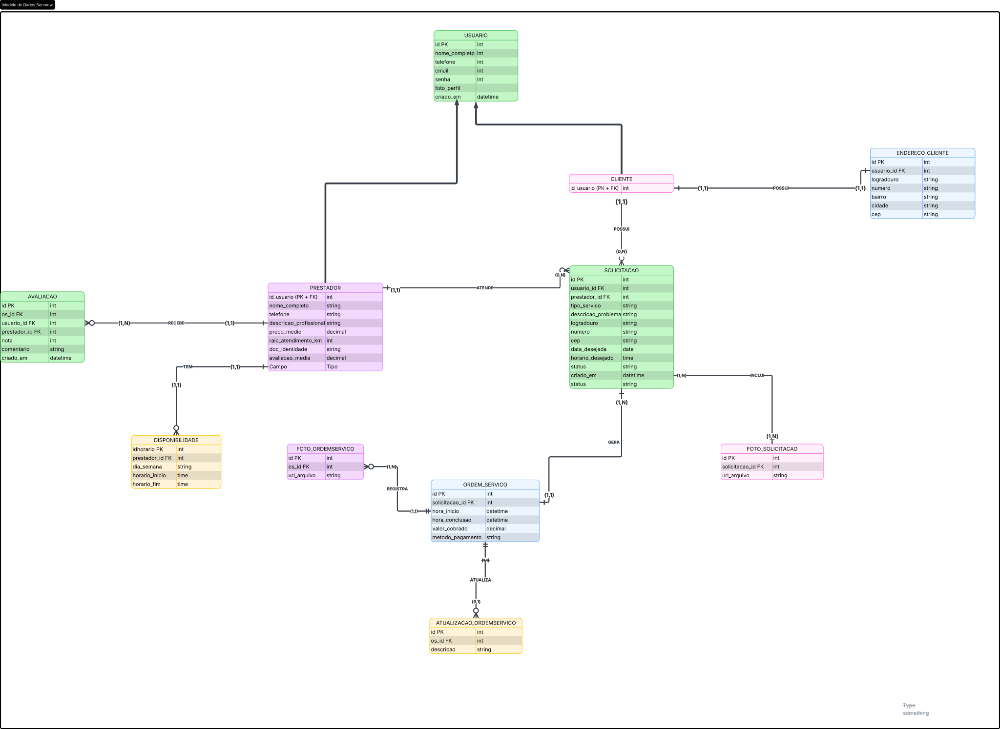

## 4. Projeto da solução

### 4.1. Modelo de dados

adiconar campo especialidade no prestador
---

### 4.2. Tecnologias

_Descreva qual(is) tecnologias você vai usar para resolver o seu problema, ou seja, implementar a sua solução. Liste todas as tecnologias envolvidas, linguagens a serem utilizadas, serviços Web, frameworks, bibliotecas, IDEs de desenvolvimento, e ferramentas.

| **Dimensão**   | **Tecnologia**     |
| ---            | ---                |
| SGBD           |  PostgreeSQL       |
| Front end      | React+Typscript+Css|
| Back end       | Java SpringBoot    |
| Deploy         | Render+Vercel      |
| Bibliotecas    | react-icons        |
                 | react-toastify     |

