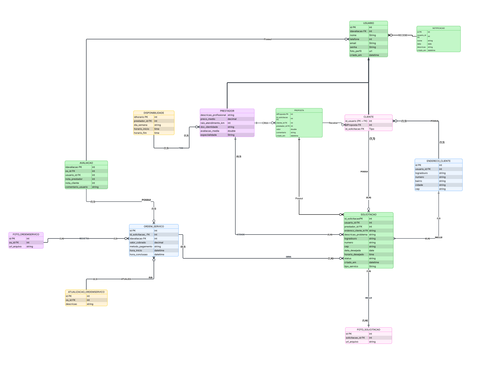

## 4. Projeto da solução

### 4.1. Modelo de dados

### 4.2. Tecnologias

Este projeto utiliza um conjunto de tecnologias modernas para desenvolvimento full-stack, garantindo escalabilidade, desempenho e facilidade de manutenção.

| Dimensão | Tecnologia |
| -------- | ---------- |
| Linguagem | Java (back-end), TypeScript (front-end) |
| Front-end | React 19, Vite, HTML5, CSS3, Tailwind CSS v4 |
| Back-end | Spring Boot, Spring Security (JWT), Spring Web |
| SGBD | PostgreSQL |
| Persistência | JPA / Hibernate |
| Bibliotecas (front) | lucide-react, react-router-dom, react-toastify, maplibre-gl (componentes mapcn), clsx, tailwind-merge |
| APIs e serviços externos | ViaCEP (consulta de CEP no front), Nominatim/OpenStreetMap , tiles CARTO/MapLibre (mapa) |
| Deploy / Hosting | Vercel (front-end), Render (back-end) |
| Banco em nuvem | PostgreSQL no Supabase |
| Ferramentas | Git, GitHub |
| IDE | VS Code  |

### 4.4. Atualização do diagrama to do
//2. Adicionar `latitude` e `longitude` em **USUARIOS** e **SOLICITACOES_SERVICO**.

