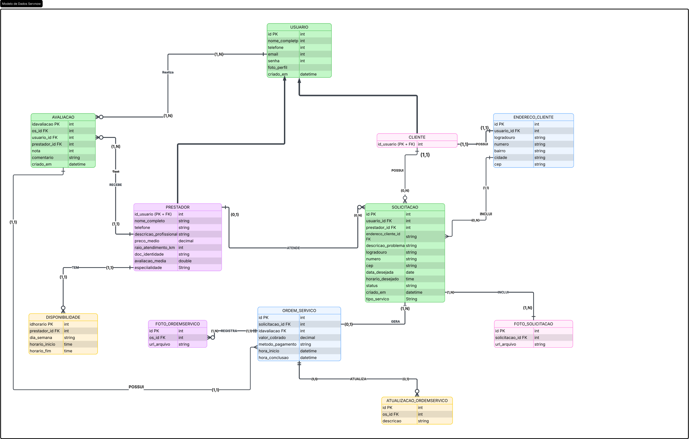

## 4. Projeto da solução

### 4.1. Modelo de dados

---

### 4.2. Tecnologias

Este projeto utiliza um conjunto de tecnologias modernas para desenvolvimento full-stack, garantindo escalabilidade, desempenho e facilidade de manutenção.

| Dimensão        | Tecnologia                                                                 |
|--------------- -|----------------------------------------------------------------------------|
| Linguagem       | Java (Back-end), TypeScript (Front-end)                                    |
| Front-end       | React (framework), HTML5, CSS3                                             |
| Back-end        | Spring Boot (framework Java)                                               |
| SGBD            | PostgreSQL                                                                 |
| Persistência    | JPA / Hibernate                                                            |
| Bibliotecas     | react-icons, react-toastify                                                |
| Deploy / Hosting| Vercel (Front-end), Render (Back-end)                                      |
| Ferramentas     | Git, GitHub.                                                               |
| IDE             | VS Code                                                                    |
| APIS            | API ViaCEP                                                                 |

